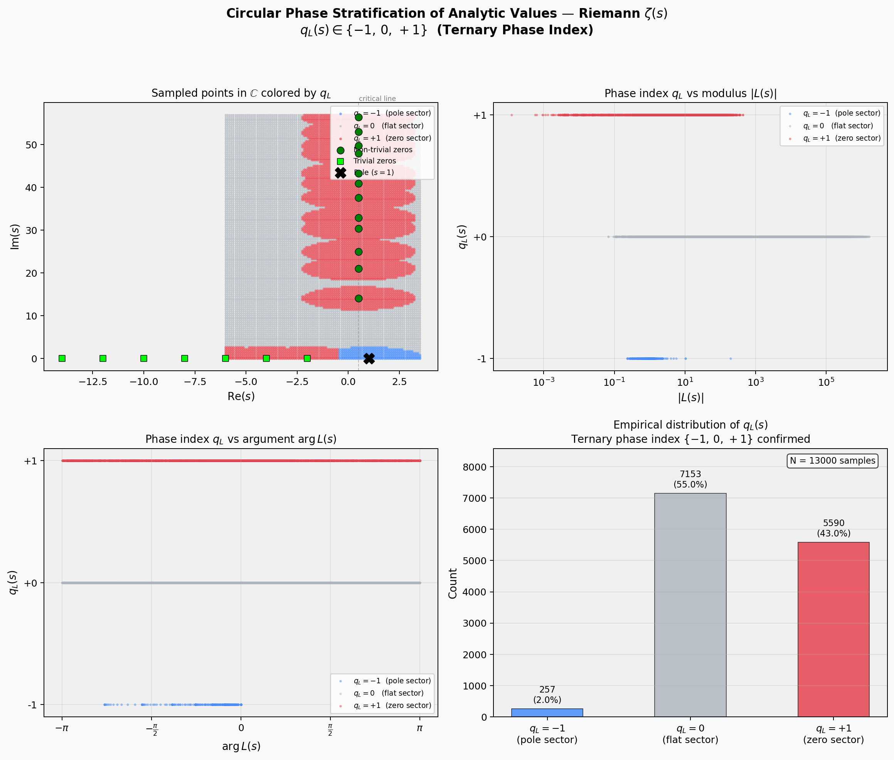
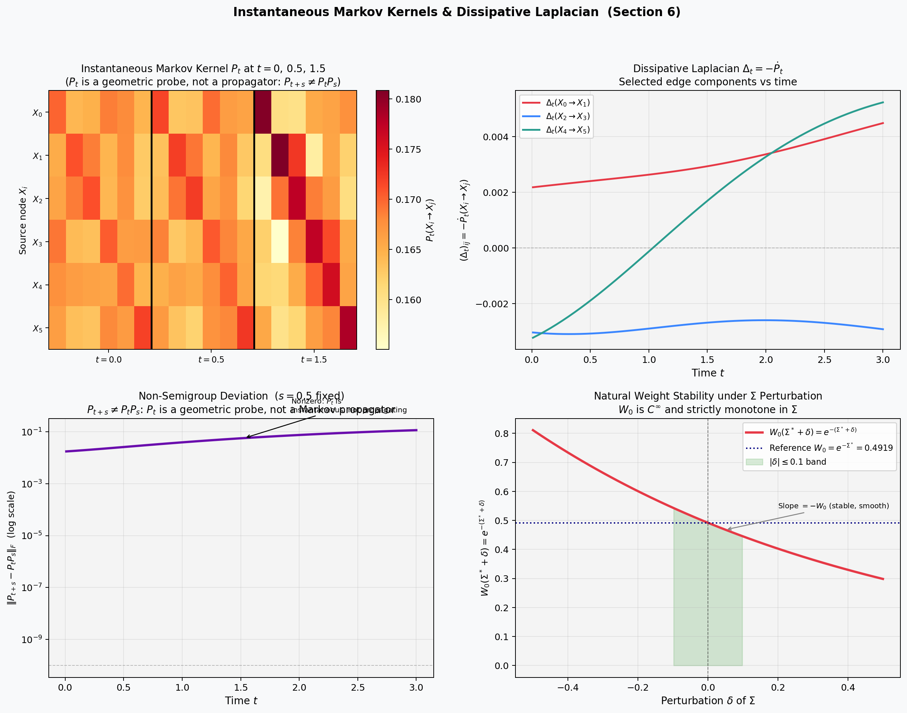
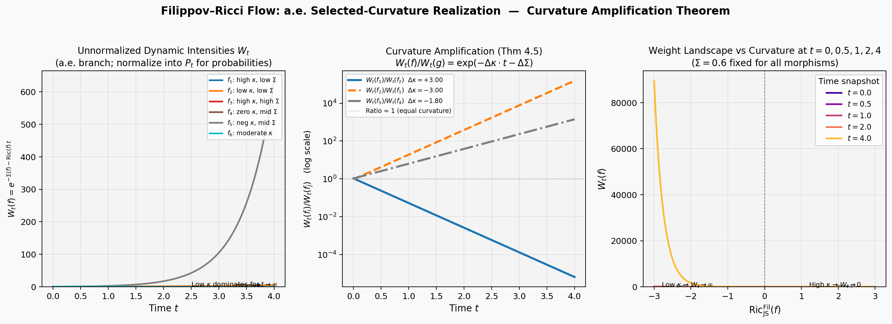
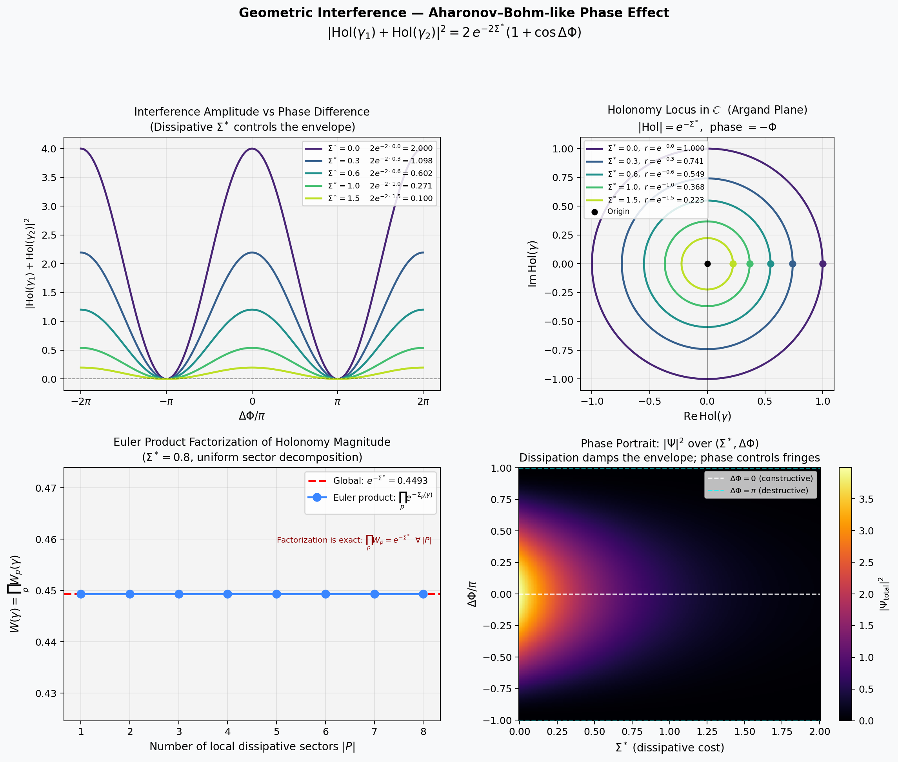

# Dissipative Systems: From the Second Law of Thermodynamics to Filippov–Ricci Geometry

**Author:** Reinaldo Elias de Souza Junior  
**Affiliation:** Faculdade de Medicina, Universidade Federal de Goiás, Brasil  
**Date:** May 2026  

[](https://doi.org/10.5281/zenodo.20339888)

---

## Abstract

We introduce a unified geometric framework for irreversible systems by equipping small categories with an additive entropy-production functional

$$
\Sigma : \mathrm{Mor}(\mathcal{C}) \to \mathbb{R}_{\ge 0}.
$$

The induced natural weights

$$
W(f) = e^{-\Sigma(f)}
$$

behave as thermodynamically consistent attenuation factors and render the category **causally rigid**: all reversible morphisms collapse to identities.

The framework establishes three structural components:

1. **Filippov–Ricci flow** — evolution of dissipative weights under nonsmooth curvature.
2. **Instantaneous Markov kernels** — geometric probes, not propagators, producing a dissipative Laplacian

$$
\Delta_t = -\dot{P}_t.
$$

3. **Complex dissipative holonomy** — magnitude controlled by dissipation and phase controlled by curvature, producing interference without Hilbert space.

A central result is the emergence of an **integer-valued arithmetic invariant**: for any analytic observable $L(s)$, with $L(s) \neq 0$, the induced phase geometry determines a ternary first Chern class

$$
c_1(L(s)) \in \{-1, 0, +1\},
$$

controlled by the local singularity structure of $L(s)$.

> **Core thesis:** Irreversibility does not destroy geometry — it reshapes it.

---

## Visual Summary

<p align="center">
  
  
</p>

<p align="center">
  
  
</p>

---

## Repository Structure

```text
.
├── theoretical_foundation/
│   └── dissipative_systems_ricci_filippov.pdf
├── images/
│   ├── chern_stratification.png
│   ├── dissipative_laplacian.png
│   ├── filippov_ricci_flow.png
│   └── holonomy_interference.png
└── code/
    ├── chern_stratification.py       # Ternary phase index q_L ∈ {-1,0,+1}
    ├── dissipative_laplacian.py      # Instantaneous kernels & Δ_t
    ├── filippov_ricci_flow.py        # Curvature amplification theorem
    └── holonomy_interference.py      # Geometric interference effect
```

---

## Theoretical Foundation

The main paper is available in:

```text
theoretical_foundation/dissipative_systems_ricci_filippov.pdf
```

It develops the categorical, thermodynamic, nonsmooth-geometric and arithmetic layers of the framework.

The central construction begins with a small category $\mathcal{C}$ endowed with an additive entropy-production functional

$$
\Sigma : \mathrm{Mor}(\mathcal{C}) \to \mathbb{R}_{\ge 0}.
$$

This turns morphisms into dissipative arrows whose natural weights satisfy

$$
W(f) = e^{-\Sigma(f)}.
$$

Composition becomes thermodynamically constrained:

$$
\Sigma(g \circ f) = \Sigma(g) + \Sigma(f),
$$

and therefore

$$
W(g \circ f) = W(g) W(f).
$$

This creates a rigid causal geometry in which reversibility is no longer a free symmetry, but a structural obstruction.

---

### Operational Coherence Layer

The code in this repository is not presented as numerical evidence replacing proof. It is presented as an operational instantiation of the formal definitions.

This follows the framework of **Operational Coherence**, where agreement between a symbolic theory and an independently written implementation across structurally relevant probes functions as a second verification channel.

In this sense, the scripts validate that the dissipative geometry defined in the paper is executable without changing ontology: the formulas, generated figures, and computational behavior remain constrained by the same formal object.

See: https://github.com/Regis3336/operational-coherence

### Validated Components

**Filippov–Ricci weight evolution:**

$$
W_t(f) = \exp(-\Sigma(f) - \mathrm{Ric}(f) t).
$$

**Non-semigroup property:**

$$
P_{t+s} \neq P_t P_s.
$$

Here $P_t$ is an instantaneous geometric probe, not a Markov propagator.

**Dissipative Laplacian:**

$$
\Delta_t = -\dot{P}_t.
$$

**Complex dissipative holonomy:**

$$
\mathrm{Hol}(\gamma) = e^{-\Sigma(\gamma)} e^{-i\Phi(\gamma)}.
$$

**Interference formula:**

$$
|\mathrm{Hol}(\gamma_1) + \mathrm{Hol}(\gamma_2)|^2 = 2e^{-2\Sigma^\ast}(1 + \cos\Delta\Phi).
$$

**Ternary Chern classification:**

$$
q_L(s) \in \{-1, 0, +1\}.
$$

### Methodological Note

Code generation preceded mathematical auditing. This protocol prevented ontological drift: the code acts as an operational anchor, forcing fidelity to the paper's definitions rather than reinterpretation through classical differential-geometric or probabilistic intuitions.

---

## Requirements

### Python Dependencies

```bash
pip install numpy matplotlib scipy mpmath
```

---

## Generate Figures

Run the following commands from the repository root:

```bash
python3 code/chern_stratification.py
python3 code/dissipative_laplacian.py
python3 code/filippov_ricci_flow.py
python3 code/holonomy_interference.py
```

On Windows PowerShell, use:

```powershell
python code/chern_stratification.py
python code/dissipative_laplacian.py
python code/filippov_ricci_flow.py
python code/holonomy_interference.py
```


---

## Key Concepts

### Dissipative Categories

A dissipative category is a small category equipped with an additive entropy-production functional

$$
\Sigma : \mathrm{Mor}(\mathcal{C}) \to \mathbb{R}_{\ge 0}.
$$

The associated weight

$$
W(f) = e^{-\Sigma(f)}
$$

encodes thermodynamic attenuation.

Causal rigidity is enforced by the condition

$$
W(f) = 1 \Longleftrightarrow f = \mathrm{id}.
$$

Thus, a morphism has zero dissipative cost only when it is structurally trivial.

---

### Filippov–Ricci Flow

The Filippov–Ricci flow describes dissipative evolution under nonsmooth curvature:

$$
\dot{W}_t(f) \in -\mathrm{Ric}^{\mathrm{Fil}}_{\mathrm{JS}}(f, W_t) \, W_t(f).
$$

The role of curvature is not to smooth the dynamics. Instead, nonsmooth curvature selects and amplifies dissipative branches.

The selected-curvature regime produces exponential separation between competing morphisms:

$$
\frac{W_t(f)}{W_t(g)} = \exp(-\Delta\kappa \, t - \Delta\Sigma).
$$

---

### Instantaneous Markov Kernels

The kernels $P_t$ are not assumed to form a semigroup. They are instantaneous Markov probes of the dissipative geometry.

Thus, in general,

$$
P_{t+s} \neq P_t P_s.
$$

The dissipative Laplacian is defined by

$$
\Delta_t = -\dot{P}_t.
$$

It records instantaneous deformation of diffusion rather than infinitesimal propagation in the classical semigroup sense.

---

### Complex Dissipative Holonomy

The complex holonomy of a path $\gamma$ is

$$
\mathrm{Hol}(\gamma) = \exp(-\Sigma(\gamma)) \exp(-i\Phi(\gamma)).
$$

Its two components have distinct geometric meanings:

```text
Magnitude = dissipation
Phase     = curvature
```

This produces interference phenomena of the form

$$
|\mathrm{Hol}(\gamma_1) + \mathrm{Hol}(\gamma_2)|^2 = 2e^{-2\Sigma^\ast}(1 + \cos\Delta\Phi).
$$

The interference is geometric rather than Hilbert-space-theoretic.

---

### Ternary Chern Classification

For an analytic observable $L(s)$, with $L(s) \neq 0$, define the normalized phase

$$
\Theta_L(s) = \frac{L(s)}{|L(s)|} \in S^1.
$$

The induced phase geometry determines a ternary first Chern class:

$$
c_1(L(s)) \in \{-1, 0, +1\}.
$$

Equivalently, the local phase index satisfies

$$
q_L(s) \in \{-1, 0, +1\}.
$$

The three regimes correspond to pole-sector, flat-sector and zero-sector behavior.

---

## Scripts and Generated Figures

### `chern_stratification.py`

Generates the circular phase stratification of analytic values and computes the ternary phase index

$$
q_L \in \{-1, 0, +1\}.
$$

---

### `dissipative_laplacian.py`

Constructs instantaneous Markov kernels $P_t$, verifies the non-semigroup deviation and computes the dissipative Laplacian

$$
\Delta_t = -\dot{P}_t.
$$

---

### `filippov_ricci_flow.py`

Simulates selected-curvature realization under Filippov–Ricci dynamics and illustrates curvature amplification:

$$
\frac{W_t(f)}{W_t(g)} = \exp(-\Delta\kappa \, t - \Delta\Sigma).
$$

---

### `holonomy_interference.py`

Generates the dissipative holonomy interference model, including amplitude damping, phase interference, Euler-product factorization and phase portrait.

The core interference law is

$$
|\mathrm{Hol}(\gamma_1) + \mathrm{Hol}(\gamma_2)|^2 = 2e^{-2\Sigma^\ast}(1 + \cos\Delta\Phi).
$$

---

## Citation

```bibtex
@article{souza2026dissipative,
  title        = {Dissipative Systems: From the Second Law of Thermodynamics to Filippov--Ricci Geometry},
  author       = {Souza Junior, Reinaldo Elias de},
  year         = {2026},
  month        = {May},
  institution  = {Faculdade de Medicina, Universidade Federal de Goi{\'a}s},
  doi          = {10.5281/zenodo.20339888}
}
```

---

## License

This work is released under the [Creative Commons Attribution 4.0 International License](https://creativecommons.org/licenses/by/4.0/).

---

## Contact

**Reinaldo Elias de Souza Junior**  
Email: resj3336@gmail.com  

---

## Acknowledgment — A Tribute to Galliano Brigo

This repository also stands as a tribute to **Galliano Brigo**, whose independent work on universal thresholds, dissipative stability, and critical transitions helped create the conceptual bridge from which this project emerged.

Galliano's early willingness to recognize an external contribution, request a formal DOI, and preserve authorship was not a minor gesture. It was an act of epistemic integrity.

This repository is, in part, a response to that gesture: a public, executable, and citable realization of the dissipative-geometric ideas that connect our trajectories.

It is dedicated to the rare kind of independent researcher who does not erase the Other, but preserves the bridge.

---

## Final Note

This framework introduces a new ontology for dissipative geometry. Classical differential-geometric intuitions — smooth connections, Chern–Weil theory and Markov semigroups — do not directly apply.

The code validates the operational consistency of the definitions. The theory stands on its own axioms.


> Irreversibility does not erase structure.  
> It selects geometry.
